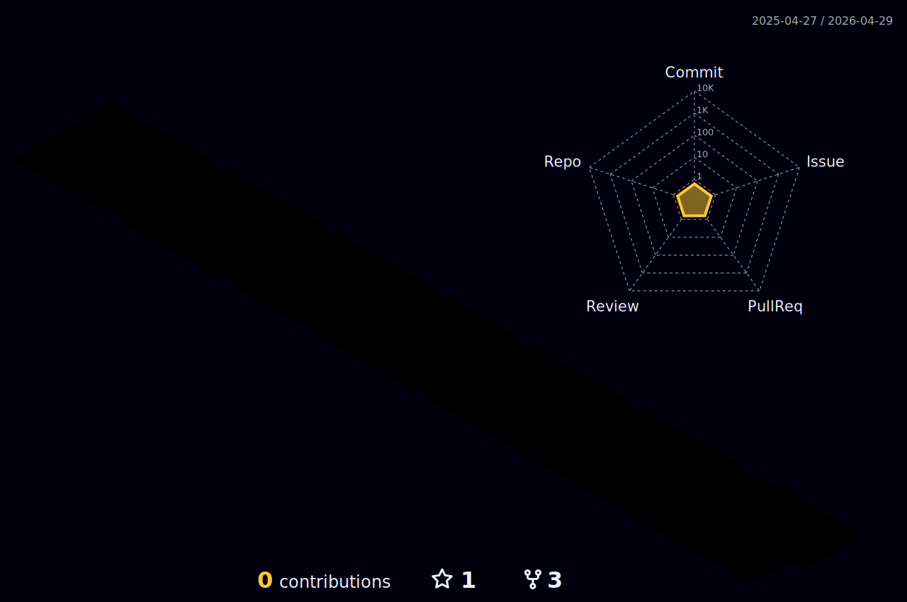

    
    
    
    
    
    
    
    
    
    
    

 

    

        
    

 

    <h1><strong>Relevant Repositories</strong></h1>
    <a style="text-decoration: none; font-size: 20px;" href="https://github.com/JVwolfart/projeto-hackathon-ada">🏆Winner at Hackathon Ada 2024 Back End</a> 
    <a style="text-decoration: none; font-size: 20px;" href="https://github.com/IgorALopes/project-historic-soccer-teams">Historic Soccer Teams</a> 
    <a style="text-decoration: none; font-size: 20px;" href="https://github.com/IgorALopes/testspart">Test for a Frontend selection process</a> 
    <a style="text-decoration: none; font-size: 20px;" href="https://github.com/IgorALopes/Projeto01-GAME-Ironhack">The Red Tower Game</a> 
    <a style="text-decoration: none; font-size: 20px;" href="https://github.com/IgorALopes/project03-CLIENT-ironhack">Game Tasting</a> 
<a style="text-decoration: none; font-size: 20px;" href="https://github.com/RHainz/oaksiteschool">Oak School</a> 

